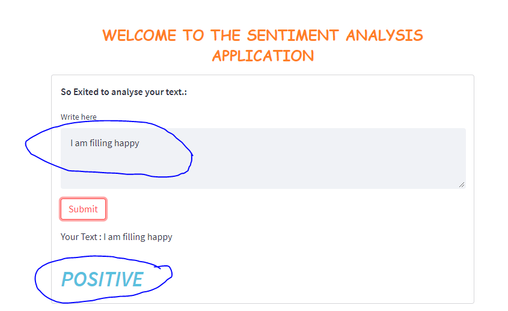
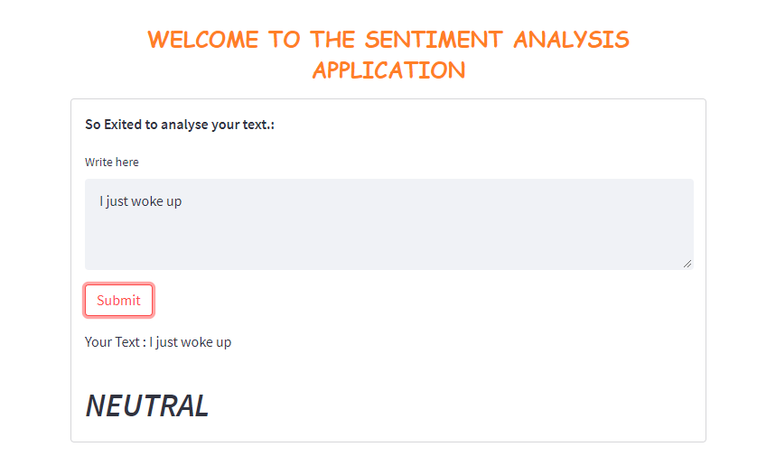
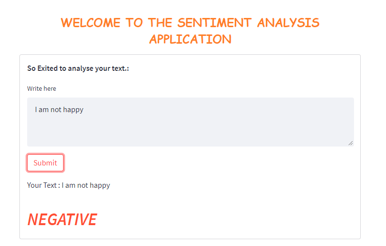

<h1>Data Analysis Application Sentiment Analysis with Tigergraph and vaderSentiment Library </h1>

You're welcome to this Repo. For any opportunity in datascience or if you need more explanation for this code, feel to contact me: <b>jlandryf@gmail.com</b>

<ol>
	<li>
		Install Virtual Environment on windows : 
		pip install virtualenv
	</li> 
	<li>
		Navigate to the folder where you want to create your application  
	</li> 
	<li>
		Open cmd and create a virtual environment :  
		virtualenv < name_of_your_environment >
	</li> 
	<li>
		Activate your virtual environment :  
		< name_of_your_environment >\Scripts\activate
	</li> 
	<li>
		Install Streamlit framework:  
		pip install streamlit
	</li> 
	<li>
		Install vaderSentiment Library :  
		pip install awesome-streamlit
	</li> 
	<li>
		Create your maim file : For example "app.py"
	</li> 
	<li>
		Install awesome-streamlit :  
		pip install awesome-streamlit
	</li> 
	<b>Here you go<b>
	
	
</ol>

<h1>Run this app on your machine </h1>

Follow the steps below : 

<ol>
	<li>
		Clone this project
	</li> 
	<li>
		install python :   <a href="https://www.python.org/downloads/" target="blank">See here</a>
	</li> 
	<li>
		install python virtual environment in the project location:   pip install virtualenv 
	</li> 
	<li>
		Activate the virtual envirenment:   sentiment-analysis-app/bin/activate
	</li> 
	<li>
		Install the requirements:   pip install -r requirements.txt
	</li> 
	<li>
		Lunch the application:   streamlit run app.py
	</li> 
  	<li>
		Copy the link generated in your console and past it in your navigator
	</li> 
	<li>
		Enjoy the app
	</li> 
</ol>

<h3><b><i>Demo</i></b></h3>

	

		
		<small>Positive santiment</small>
	

	<h1></h1>
	

		
		<small>Neutral santiment</small>
	

	<h1></h1>
	

		
		<small>Negative santiment</small>
	

	<h1></h1>

